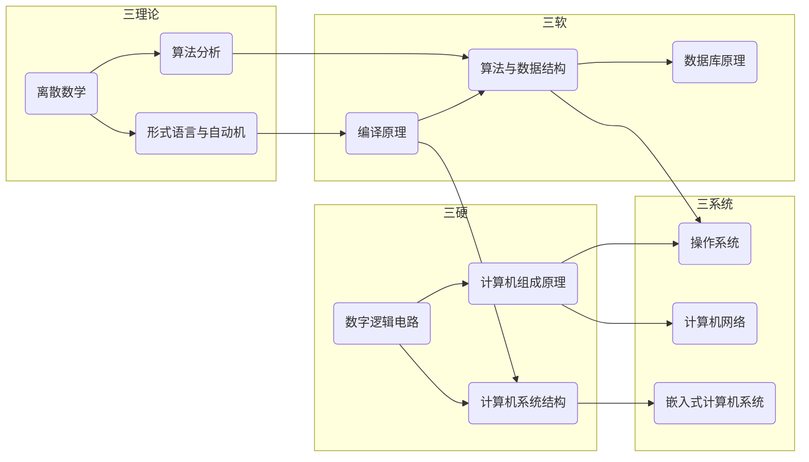
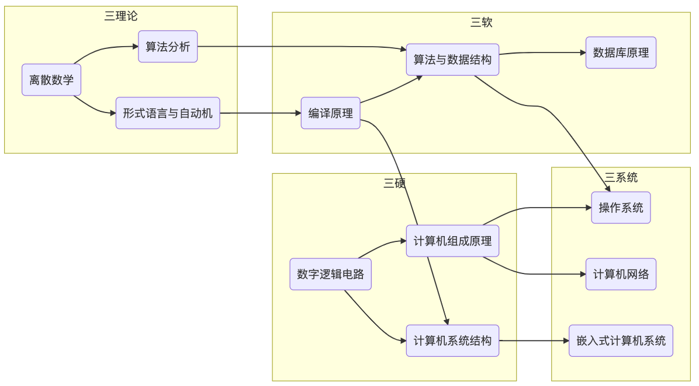

# 关系图
[[toc]]
## 计算机课程
计算机课程主要包括“三硬，三软，三理论，三系统”

### 计算机硬件相关 
:::details 详情
+ 计算机组成原理

计算机组成指的是系统结构的逻辑实现，包括机器机内的数据流和控制流的组成及逻辑设计等。主要分为五个部分：控制器，运算器，存储器，输入设备，输出设备。
+ 计算机系统结构

计算机系统结构是计算机的机器语言程序员或编译程序编写者所看到的外特性。所谓外特性，就是计算机的概念性结构和功能特性，主要研究计算机系统的基本工作原理，以及在硬件、软件界面划分的权衡策略，建立完整的、系统的计算机软硬件整体概念。
+ 数字逻辑电路

数字逻辑是数字电路逻辑设计的简称，其内容是应用数字电路进行数字系统逻辑设计。电子数字计算机是由具有各种逻辑功能的逻辑部件组成的，这些逻辑部件按其结构可分为组合逻辑电路和时序逻辑电路。组合逻辑电路是由与门、或门和非门等门电路组合形成的逻辑电路；时序逻辑电路是由触发器和门电路组成的具有记忆能力的逻辑电路。有了组合逻辑电路和时序逻辑电路，再进行合理的设计和安排，就可以设计出符合要求的数字系统。数字逻辑是计算机基础理论的一个重要组成部分，它为计算机组成原理和微型计算机及应用等后续课程提供必要的逻辑基础，是计算机及相关专业的一门专业基础课。
:::
### 计算机软件相关 
:::details 详情
+ 算法与数据结构
 
数据结构是计算机存储、组织数据的方式。在现实世界中，不同数据元素之间不是独立的，而是存在特定关系的，我们将这些关系称为结构。同样在计算机中，数据元素也不是孤立、杂乱无序的，而是具有内在联系的数据集合。

算法是解决特定问题求解步骤的描述，在计算机中表现为指令的有限序列，并且每条指令表示一个或多个操作。
+ 数据库原理

《数据库原理》是信息管理与信息系统专业的重要专业基础课。主要介绍数据库系统的基本概念、数据模型、关系数据库及其标准语言SQL、数据库安全性和完整性的概念，关系规范化理论，数据库设计方法和步骤，数据库恢复和并发控制，关系查询处理和查询优化等有关数据库系统的基础理论、基本技术和基本方法。通过学习，学生掌握数据库分析、设计和实施的基本原理和方法，能解决系统开发中数据库相关的实际问题。
+ 编译原理

编译原理是计算机专业的一门重要专业课，旨在介绍编译程序构造的一般原理和基本方法。内容包括语言和文法、词法分析、语法分析、语法制导翻译、中间代码生成、存储管理、代码优化和目标代码生成。 编译原理是计算机专业设置的一门重要的专业课程。编译原理课程是计算机相关专业学生的必修课程和高等学校培养计算机专业人才的基础及核心课程，同时也是计算机专业课程中最难及最挑战学习能力的课程之一。编译原理课程内容主要是原理性质，高度抽象。
:::
### 计算机基础理论 
:::details 详情
+ 离散数学

《离散数学》是计算机科学与技术学科各专业的核心基础课程。

离散数学的最大特点或最基本特征就在于构造性。离散数学是培养学生抽象思维和严密概括能力的素质训练课程。因此离散数学是计算机科学和技术的重要理论基础之一，为计算机科学与技术学科各分支领域解决其基本问题提供了强有力的数学工具，具有十分广泛的应用。因此离散数学是计算机科学与技术学科各专业最重要的基础课程之一。计算机科学与技术学科各专业的学生学习离散数学，一方面为学习各专业课程作必要的数学准备，另一方面，培养和训练他们掌握使用数学语言或符号系统处理问题的基本方法，提高学生的逻辑推理能力、抽象思维能力和形式化思维能力。
+ 形式语言与自动机

《形式语言与自动机》以四类形式语言（短语结构语言、上下文有关语言、上下文无关语言、正则语言）和四种自动机（有穷自动机、下推自动机、图灵机、线性有界自动机）为主线，讨论了形式语言与自动机方面的主要理论成果和应用实例。书中每一章的最后都配有大量不同难度的习题，有助于读者掌握本书内容。
+ 算法分析

算法设计与分析是北京大学信息科学技术学院屈婉玲教授为主讲授的算法设计与分析系列MOOC课程之基础篇。中国计算机学会（CCF）授予她2017“CCF夏培肃奖”，表彰她在算法等课程的建设与教学中所作出的杰出贡献，本课程由北大算法设计与分析教学团队的汪小林、蒋婷婷、罗国杰等教师辅助屈婉玲教授开设。
:::
### 计算机相关系统 
:::details 详情
+ 操作系统

教学重点放在培养学生的学习能力、动手能力、系统分析能力、创新实践能力上。教学模式从传授知识，转为能力培养与教研结合。考核更侧重对学生实际动手能力的测试。以学习Linux内核为重点，结合Linux的多层次实践体系为支撑，激励研究性学习。本课程为2006年国家精品课程。
+ 计算机网络

计算机网络是计算机专业学生必修的一门专业基础课和核心课程，它是后续课程《计算机系统安全》、《网络管理技术》、《TCP/IP与网络互联》等理论课程，以及《网络课程设计》等实践教学环节的先行课。《计算机网络》课程的教学，旨在使学生掌握计算机网络的体系结构和流行的参考模型，掌握物理层标准的基本原理和数据通信技术，掌握数据链路层协议的工作原理和常见实例，掌握局域网基本原理和组网方法，掌握广域网基本原理和接入方法，掌握网络互连的基本知识和IP协议的运行机制，掌握传输层协议的工作原理和TCP、UDP协议的运行原理，掌握应用层常见协议和网络服务的工作原理，以及应用系统构架方法，了解计算机网络技术发展的前沿技术，为培养学生在计算机网络系统的规划与构建，网络应用系统的建立与开发等方面能力打下坚实的基础。
+ 嵌入式计算机系统

嵌入式系统是一种专用的计算机系统,，用于控制、监视或者辅助操作机器和设备的装置。通常，嵌入式系统是一个控制程序存储在ROM中的嵌入式处理器控制板。事实上，所有带有数字接口的设备，如手表、微波炉、录像机、汽车等，都使用嵌入式系统，有些嵌入式系统还包含操作系统，但大多数嵌入式系统都是由单个程序实现整个控制逻辑。
:::
## 课程关系
:::details mermaid代码

:::

